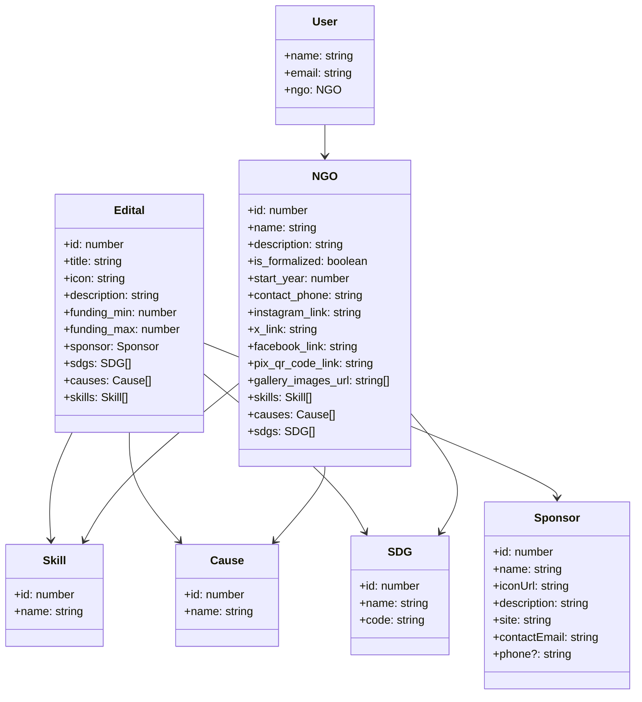

# Editais - CinBoraImpactar

Um projeto realizado para a disciplina de Desenvolvimento de Software para ajudar organizações não-governamentais (ONGs) a encontrar oportunidades de fomentos como editais.

## Equipe

|  |  |  |  |  |
|--------------------------------------------------------------------------------------------------------------------------------------------|--------------------------------------------------------------------------------------------------------------------------------------------|--------------------------------------------------------------------------------------------------------------------------------------------|--------------------------------------------------------------------------------------------------------------------------------------------|--------------------------------------------------------------------------------------------------------------------------------------------|
| [Felipe Oliveira](https://github.com/feelps-1)                                                                                             | [Paulo César](https://github.com/paulo-cesar-pereira)                                                                                     | [Thaphylla Ayanny](https://github.com/tatudep)                                                                                             | [Matheus Sobreira](https://github.com/Mhtz-01)                                                                                             | [Mateus Alexandre](https://github.com/Alexslec)                                                                                             |

---

## Tecnologias Utilizadas (Stack)

- **Front-end:** Next.js, React, Typescript
- **Back-end:** Node.js
- **Banco de Dados:** PostgreSQL, SQL
- **Testes:** Jest

---

## Funcionalidades

- **Listar editais disponíveis**
- **Expandir detalhes de um edital**
- **Salvar editais para visualizar depois**
- **Receber recomendações de editais com base no perfil da ONG**
- **Filtrar pesquisa de editais por critérios como área de atuação, valor do fomento, etc.**

---

## Diagrama de Classes

---

## Contribuição

Contribuições são bem-vindas! Para contribuir, siga estas etapas:

1. **Fork** o repositório
2. Crie uma nova branch: `git checkout -b minha-feature`
3. Faça as alterações e commit: `git commit -m 'Adiciona nova feature'`
4. Envie as alterações: `git push origin minha-feature`
5. Abra um **Pull Request**

---

## Licença

Este projeto está sob a licença MIT. Veja o arquivo `LICENSE` para mais detalhes.
